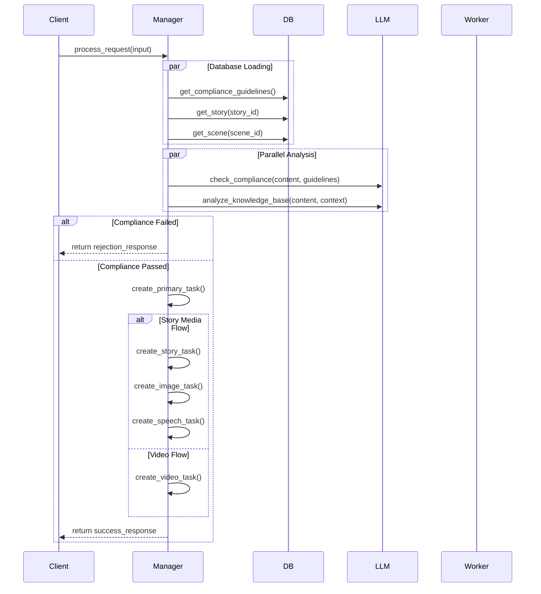

# Manager Agent System

## Overview

The Manager Agent is a central orchestration system responsible for:
1. Content compliance validation
2. Story analysis and task planning
3. Task creation and routing
4. Media generation coordination

## Project Structure

```
.
├── README.md
├── db_schema.md              # Database schema and interactions
├── dev_manager_agent.md      # Manager agent development guide
├── layer2_agent_setup.md     # Layer 2 agent implementation guide
├── manager_agent.py          # Main manager agent implementation
├── models.py                 # Data models and schemas
├── config.py                 # Configuration and constants
├── database.py              # Database operations
├── llm_factory.py           # LLM integration
├── custom_llm_base.py       # Base LLM functionality
├── custom_llm_groq.py       # Groq LLM implementation
├── custom_llm_mistral.py    # Mistral LLM implementation
└── test_manager.py          # Manager agent tests
```

## Setup

1. Install dependencies:
```bash
pip install -r requirements.txt
```

2. Set up environment variables:
```env
GROQ_API_KEY=your_groq_key
MISTRAL_API_KEY=your_mistral_key
```

3. Initialize the database:
```python
from database import Database
db = Database()
await db.init_db()
```

## Documentation

- `db_schema.md`: Details the database schema and manager agent interactions
- `dev_manager_agent.md`: Complete development guide for the manager agent
- `layer2_agent_setup.md`: Implementation guide for worker agents

## Testing

Run tests with:
```bash
python -m pytest test_manager.py -v
```

## Flow Diagram



## Key Features

1. **Task Management**
   - In-memory task tracking
   - Task status monitoring
   - Task routing to worker agents

2. **Content Analysis**
   - Content compliance checking
   - Story analysis and planning
   - Media requirements analysis

3. **Database Operations**
   - Efficient data retrieval
   - Minimal JSON parsing
   - Optimized queries

4. **Error Handling**
   - Standardized error responses
   - Detailed error logging
   - Fallback mechanisms

## Development Guidelines

1. **Code Style**
   - Follow PEP 8
   - Use type hints
   - Document all functions

2. **Testing**
   - Write unit tests
   - Test error cases
   - Mock external services

3. **Error Handling**
   - Use try/except blocks
   - Log errors properly
   - Return standardized responses

4. **Performance**
   - Use connection pooling
   - Minimize database calls
   - Cache when appropriate 