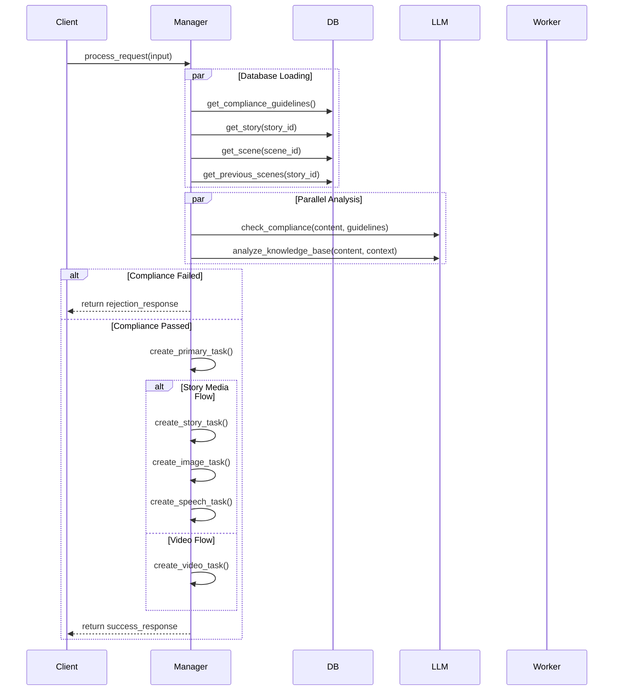

# Manager Agent Development Guide

## Overview

The Manager Agent is the central orchestrator responsible for:
1. Content compliance validation
2. Story analysis and task planning
3. Task creation and routing
4. Media generation coordination

## Input/Output Schemas

### 1. Input Schema
```typescript
interface ManagerInput {
    user_id: string;
    content: {
        user_input: string;
        context?: {
            style?: string;
            tone?: string;
            characters?: Character[];
            previous_scenes?: Scene[];
        };
    };
    flow_type: "story_media" | "video";
    story_id?: string;
    scene_id?: string;
}

interface Character {
    id: string;
    name: string;
    description: string;
    traits?: string[];
    voice_settings?: VoiceSettings;
}

interface Scene {
    id: string;
    number: number;
    content: string;
    analysis?: SceneAnalysis;
}
```

### 2. Output Schema
```typescript
interface ManagerOutput {
    status: "success" | "error" | "rejected";
    task_id: string;
    tasks?: Task[];
    error?: {
        type: string;
        message: string;
        suggestions?: string[];
    };
}

interface Task {
    task_id: string;
    task_type: "story" | "image" | "speech" | "video";
    status: "pending" | "processing" | "completed" | "failed";
    content: {
        [key: string]: any;
        story_elements?: string;
        visual_elements?: string;
        audio_elements?: string;
    };
    compliance_result: ComplianceResult;
    task_analysis: TaskAnalysis;
    parent_task_id?: string;
    metadata: Record<string, any>;
}
```

## Processing Flow



## Key Methods

### 1. Process Request
```python
async def process_request(
    self,
    user_id: str,
    content: Dict[str, Any],
    flow_type: TaskFlow,
    story_id: Optional[str] = None,
    scene_id: Optional[str] = None
) -> Dict[str, Any]:
    """
    Main entry point for processing requests
    """
    # Create task record
    task = self._create_task(user_id, content, flow_type, story_id, scene_id)
    
    try:
        # Get required data
        guidelines = await self.db.get_compliance_guidelines()
        story = await self.db.get_story(story_id) if story_id else None
        scene = await self.db.get_scene(scene_id) if scene_id else None
        prev_scenes = await self.db.get_previous_scenes(story_id, 3) if story_id else []
        
        # Run parallel analysis
        compliance_result, kb_result = await self._process_parallel_results(
            await asyncio.gather(
                self._check_compliance(content, guidelines),
                self._analyze_knowledge_base(content, story, scene, prev_scenes)
            )
        )
        
        # Handle compliance failure
        if not compliance_result["is_safe"]:
            return await self._handle_compliance_failure(task, compliance_result)
            
        # Process based on flow type
        if flow_type == TaskFlow.STORY_MEDIA:
            return await self._handle_story_media_flow(task, content, kb_result)
        else:
            return await self._handle_video_flow(task, content, kb_result)
            
    except Exception as e:
        return await self._handle_error(task, str(e))
```

### 2. Compliance Check
```python
async def _check_compliance(
    self,
    content: Dict[str, Any],
    guidelines: str
) -> Dict[str, Any]:
    """
    Check content compliance against guidelines
    """
    try:
        # Generate compliance prompt
        compliance_prompt = PROMPT_TEMPLATES["compliance_check"].format(
            content=content["user_input"],
            guidelines=guidelines
        )
        
        # Get LLM response
        result = await self.llm_manager.execute_with_fallback(
            compliance_prompt,
            system_message="You are a content compliance checker.",
            response_type="compliance_check"
        )
        
        return {
            "is_safe": result["content"]["is_safe"],
            "reasoning": result["content"]["explanation"],
            "concerns": result["content"]["concerns"],
            "suggestions": result["content"]["suggestions"]
        }
        
    except Exception as e:
        raise LLMError(f"Compliance check failed: {str(e)}")
```

### 3. Knowledge Base Analysis
```python
async def _analyze_knowledge_base(
    self,
    content: Dict[str, Any],
    story: Optional[Story],
    scene: Optional[Scene],
    prev_scenes: List[Scene]
) -> Dict[str, Any]:
    """
    Analyze content and context for task planning
    """
    try:
        # Prepare context
        context = {
            "story": self._prepare_story_context(story),
            "scene": self._prepare_scene_context(scene),
            "previous_scenes": [
                self._prepare_scene_context(s) for s in prev_scenes
            ]
        }
        
        # Generate analysis prompt
        kb_prompt = PROMPT_TEMPLATES["story_analysis"].format(
            content=content["user_input"],
            context=json.dumps(context)
        )
        
        # Get LLM response
        result = await self.llm_manager.execute_with_fallback(
            kb_prompt,
            system_message="You are a story analysis expert.",
            response_type="story_analysis"
        )
        
        return {
            "agent_analysis": result["content"]
        }
        
    except Exception as e:
        raise LLMError(f"Knowledge base analysis failed: {str(e)}")
```

## Task Creation Logic

### 1. Story Media Flow
```python
async def _handle_story_media_flow(
    self,
    task: Task,
    content: Dict[str, Any],
    kb_result: Dict[str, Any]
) -> Dict[str, Any]:
    """
    Handle story media flow task creation
    """
    tasks = []
    
    # Create story task
    story_task = await self._create_story_task(task, content, kb_result)
    tasks.append(story_task)
    
    # Create image task if needed
    if kb_result["agent_analysis"].get("image_agent"):
        image_task = self._create_image_task(task, content, kb_result)
        tasks.append(image_task)
    
    # Create speech task if needed
    if kb_result["agent_analysis"].get("speech_agent"):
        speech_task = self._create_speech_task(task, content, kb_result)
        tasks.append(speech_task)
    
    return {
        "status": "success",
        "task_id": task.task_id,
        "tasks": [t.dict() for t in tasks]
    }
```

### 2. Video Flow
```python
async def _handle_video_flow(
    self,
    task: Task,
    content: Dict[str, Any],
    kb_result: Dict[str, Any]
) -> Dict[str, Any]:
    """
    Handle video flow task creation
    """
    video_task = await self._create_video_task(task, content, kb_result)
    
    return {
        "status": "success",
        "task_id": task.task_id,
        "video_task": video_task.dict()
    }
```

## Error Handling

```python
async def _handle_error(
    self,
    task: Task,
    error_message: str
) -> Dict[str, Any]:
    """
    Handle task error
    """
    task.status = TaskStatus.FAILED
    task.metadata["error"] = error_message
    
    return {
        "status": "error",
        "task_id": task.task_id,
        "error": {
            "type": "task_execution_error",
            "message": error_message
        }
    }
```

## Development Guidelines

1. **Error Handling**
   - Always use try/except blocks for external calls
   - Log errors with appropriate context
   - Return standardized error responses

2. **Validation**
   - Validate input parameters
   - Validate LLM responses
   - Validate task creation parameters

3. **Logging**
   - Log start/end of major operations
   - Log key decision points
   - Include relevant IDs in log messages

4. **Testing**
   - Unit test each major method
   - Integration test full flows
   - Test error handling paths 